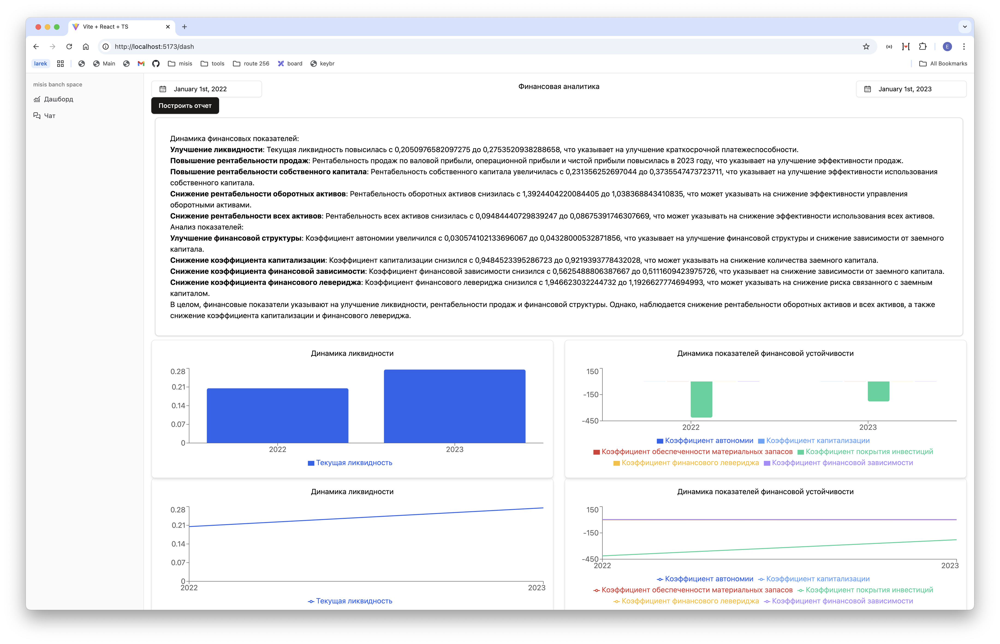
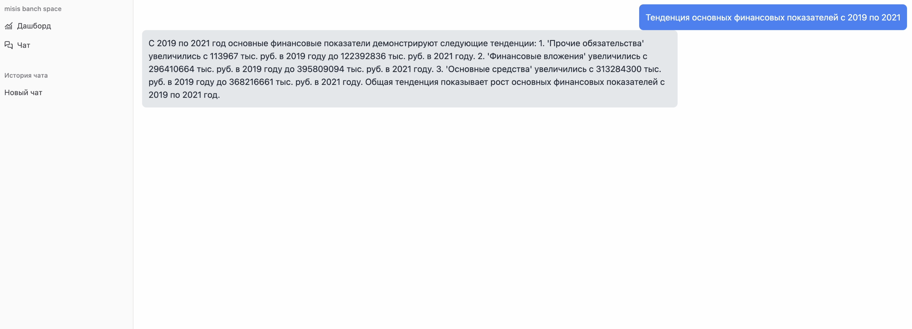

# Решение команды misis banach space | Система аналитики финансовых электронных документов RAG-инструментами | Кейс МТС

Система обработки и построения аналитики финансовых электронных документов содержит 2 микросервиса и реализует функционал в виде построения отчетных графиков и чат-бота.

## Архитектура


## Дашборд



## Чат



## RAG

- Запрос пользователя проходит классификацию для определения релевантности. В случае нерелевантности сервис отправляет вежливое сообщение о невозможности ответа.
- Используется метод multi query rag: генерируются перефразы запроса, каждая из которых проходит раг-пайплайн как самостоятельный запрос. Ответ на изначальный запрос составляется из документов, подобранных к искусственным промптам.
- Векторизация запросов осуществляется с помощью модели LaBSE на русском языке.
- Применяется метод Hypothetical Question Indexing: векторизуются не только текстовые чанки, но и генерируются вопросы для поиска. Поиск осуществляется в парадигмах <запрос, ответ> и <вопрос, схожий вопрос>.
- К найденным текстовым чанкам применяется reranking с использованием модели bge-reranker для получения topK самых релевантных.
- Заключительный этап: качественно отобранный контекст передается в LLM для генерации ответа.
**Комбинация методов значительно улучшает качество поиска.**

## Работа с данными

Собрали датасет из 20000 документов, текстовые и табличные отчеты, а также графические интерпретации.
Для извлечения информации использовались модели был проведен препроцессинг (удаление печатей, выравнивание), а затем применены модели EasyOCR и img-to-table.
Получившиеся объекты склеивались в json-объекты, чтобы в дальнейшем использовать их при построении отчетов и ответах на вопросы.

## api/логика

Сервис, реализующий бизнес-логику и взаимодействие с сервисом аналитики.
Предоставляет API управления сессиями пользователя в чате, для возможности удобного сохранения истории запросов и ответов.
Все запросы и ответы пользователя сохраняются в базе данных PostgreSQL.

Взаимодействие с сервисом аналитики происходит через протокол gRPC.
[Интерфейс](./proto/analytics/analytics.proto) реализует 2 метода:

- `GetCharts` - построение графиков по финансовым документов.
- `GetDescriptionStream` - получение ответов на запросы в чате, с генерацией по токенам.

## Запуск сервиса

Для локального запуска требуются утилиты make и docker-compose.

```bash
docker compose -f infra/compose.yaml up -d --build  
```

## Стек технологий

### Backend

- Golang: использован для реализации сервиса с бизнес-логикой.
- PostgreSQL: хранение запросов и ответов пользователя в различных сессиях.
- Jaeger: трассировка запросов.
- Docker: контейнеризация сервисов.

### ML/Analytics/DE

- Python: использован для реализации сервиса с аналитикой и работы с данными.
- MongoDB: хранение расчитанных графиков и агрегатов по финасовым документам.
- S3: хранилище для исходных файлов, которые обрабатываются сервисом.
- QDrant: хранение и поиск по векторам.

### Frontend

- TypeScript, JavaScript
- React: фреймворк для создания пользовательского интерфейса.

## Источники данных

- [Годовая отчетность](https://moskva.mts.ru/about/investoram-i-akcioneram/korporativnoe-upravlenie/raskritie-informacii/godovaya-otchetnost)
- [Выпуск ценных бумаг](https://moskva.mts.ru/about/investoram-i-akcioneram/korporativnoe-upravlenie/raskritie-informacii/vipusk-cennih-bumag)
- [Сообщения](https://moskva.mts.ru/about/investoram-i-akcioneram/korporativnoe-upravlenie/raskritie-informacii/soobshheniya)
- [Выпуск CFA](https://moskva.mts.ru/about/investoram-i-akcioneram/korporativnoe-upravlenie/raskritie-informacii/vypusk-cfa)
- [Существенные факты](https://moskva.mts.ru/about/investoram-i-akcioneram/korporativnoe-upravlenie/raskritie-informacii/sushhestvennie-fakti)
- [Ежеквартальные отчеты](https://moskva.mts.ru/about/investoram-i-akcioneram/korporativnoe-upravlenie/raskritie-informacii/ezhekvartalnie-otcheti)
- [Отчеты эмитента эмиссионных ценных бумаг](https://moskva.mts.ru/about/investoram-i-akcioneram/korporativnoe-upravlenie/raskritie-informacii/otchety-emitenta-emissionnyh-cennyh-bumag)
- [Инсайдерская информация ПАО МТС](https://moskva.mts.ru/about/investoram-i-akcioneram/korporativnoe-upravlenie/raskritie-informacii/insajderskaya-informacii-pao-mts)

## Состав команды

- Мария Ульянова - ML
- Надежда Анисимова - ML
- Егор Тарасов - fullstack
- Евгений Гуров - backend
- Артем Цыканов - ML
